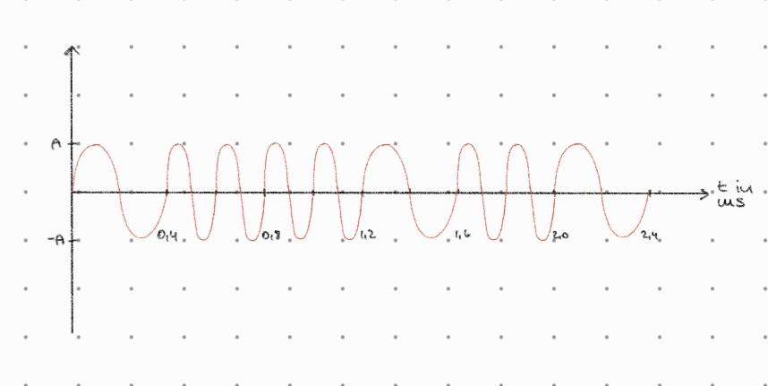

# Lerngruppenbrief

**_Lernblock_**: 1

**_Konsultationstermin_**: Do 09:30

**_Lerngruppen-Nummer_**: 7

**_Lerngruppen-Sprecher_**: Willy Kirchner

**_Aktive Teilnehmer_**: Jana Bergk, Simon Günther, Willy Kirchner, Constantin Stumm, Estelle Wünsche

## Aufgaben

Wir haben folgende Aufgaben gelöst und schätzen sie wie folgt ein:

| Nummer | Leicht | Mittel | Schwer | Gelöst | Nicht Gelöst |
| ------ | ------ | ------ | ------ | ------ | ------------ |
| 1      |        | x      |        | x      |              |
| 2      | x      |        |        | x      |              |
| 3      | x      |        |        | x      |              |
| 4      |        |        |        |        |              |
| 5      |        |        |        |        |              |
| 6      |        |        |        |        |              |
| 7      |        |        |        |        |              |
| 8      | x      |        |        | x      |              |
| 9      | x      |        |        | x      |              |
| 10     | x      |        |        | x      |              |
| 11     | x      |        |        | x      |              |

## Probleme

{TODO bitte beschreibt kurz die aufgetretenen Probleme}

## Hinweise/Anfragen an den Tutor

{TODO bitte ausfüllen sofern benötigt}

## Lösungen

### Aufgabe 1

**Information**

- Bedeutung, die durch eine Nachricht übermittelt wird

**Signal**

- physikalische Repräsentation einer Information auf einem bestimmten Medium z.B. als elektromagnetische Welle (WIFI), Lichtwelle (Glasfaserkabel), Schallwellen in Luft oder Wasser

**Nachricht**

- sind Daten, die wahrnehmbar sind und als Signale gespeichert oder übertragen werden können

**Übertragungsmedien**

- Luft/ Wasser/ Vakuum
  
  - Übertragung von Daten in Form von elektromagnetischen Wellen oder gezielten Lichtimpulsen
  
  - Signale stoßen auf wenig Widerstand und können so schnell und kostengünstig übertragen werden
  
  - störanfällig (Störfrequenzen, Hindernisse wie z.B. Wände)

- Elektrischer Leiter
  
  - Übertragung über elektronische Signale
  
  - je nach Leitfähigkeit des Mediums schnelle Datenübertragung über weite Distanzen hinweg 
  
  - Risiken für zuverlässige Übertragung: unzureichend abgeschirmte Kabel, beschädigte/ gerissene Kabel (z.B. Unterseekabel)

- Glasfaserkabel
  
  - Übertragung über Lichtwellen
  
  - Schnellste Übertragung über weite Distanzen, sehr teuer
  
  - Fasern sehr empfindlich gegenüber mechanischen Einflüssen, Notwendigkeit von zusätzlicher Signalumwandlung (elektr. Signal <-> Lichtsignal)

### Aufgabe 2

- Amplitude
- Frequenz
- Phase

### Aufgabe 3

- Durch Abtasten des (analogen) Signals zu diskreten Zeitpunkten und Zuordnen der abgetasteten Werte zu diskreten vorgegebenen Werten

- Signal ließe sich theoretisch durch Annäherung an unendlich viele, unendlich dicht beieinanderliegende Abtastwerte rekonstruieren - ist durch die Endlichkeit der jeweiligen diskreten Werte (zeitlich und wert-diskret) eingeschränkt

- Fehler beim Einlesen - falsche Zuordnung analoger zu diskreten Werten,
analoge Werte außerhalb diskreten Werteskala (zB größer oder kleiner)

### Aufgabe 4

### Aufgabe 5

- Vorteile: einfache Implementierung, geringe Bandbreite nötig
- Nachteile: Anfällig für Störungen und Rauschen, da Signal eventuell falsch, sobald Amplitude geändert, Qualität des Signals bei Amplitudenmodulation schlechter als bei anderen Verfahren

### Aufgabe 6

### Aufgabe 7

- Drahtlose Telegrafie
- Datenübertragung nach HART-Protokoll in der Mess- und Regeltechnik

### Aufgabe 8

### Aufgabe 9

**Pro:**

- Energieeffizient

- weniger störanfällig als ASK

**Contra:**

- Synchronisierungssequenz notwendig

- Komplexe Algorithmen zur Dekodierung von Daten

### Aufgabe 10

### Aufgabe 11

log_2(16) = 4 Bit

